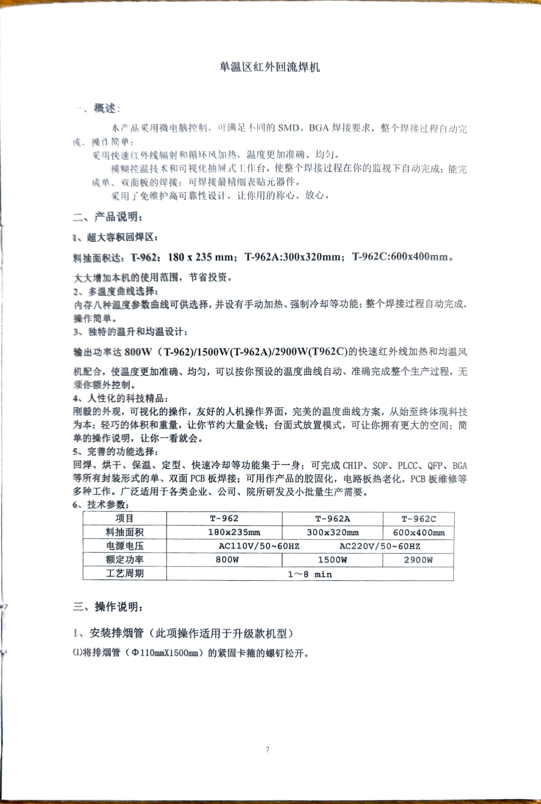
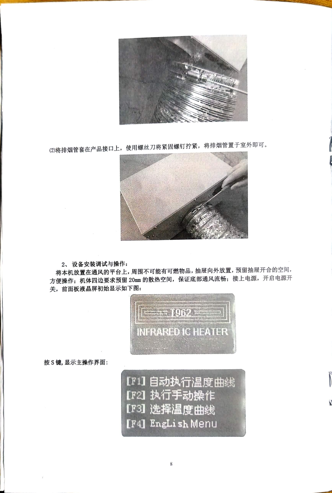
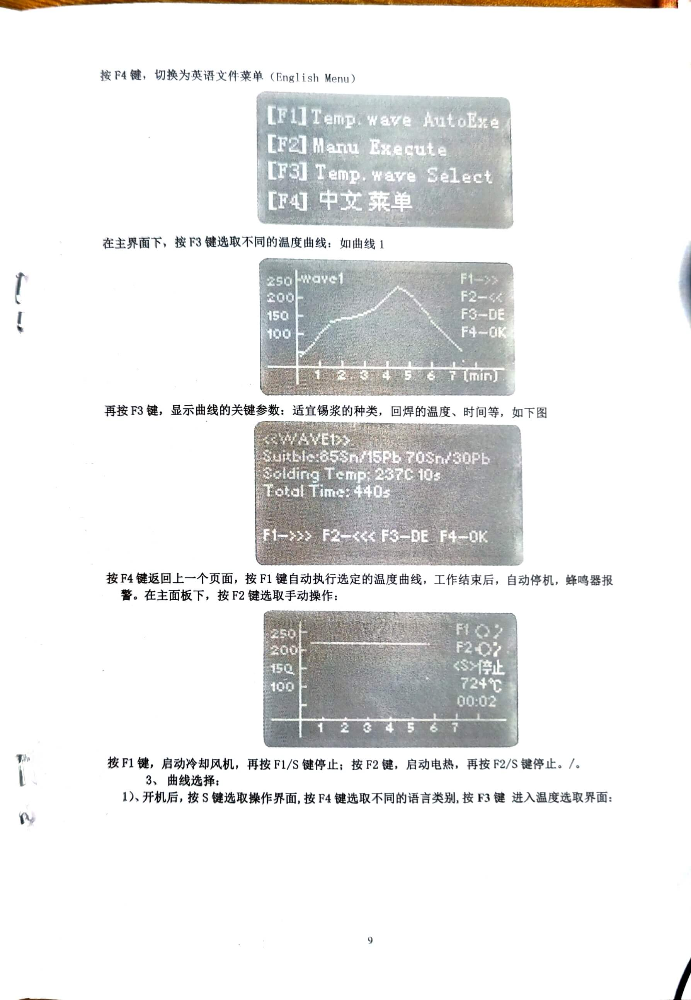
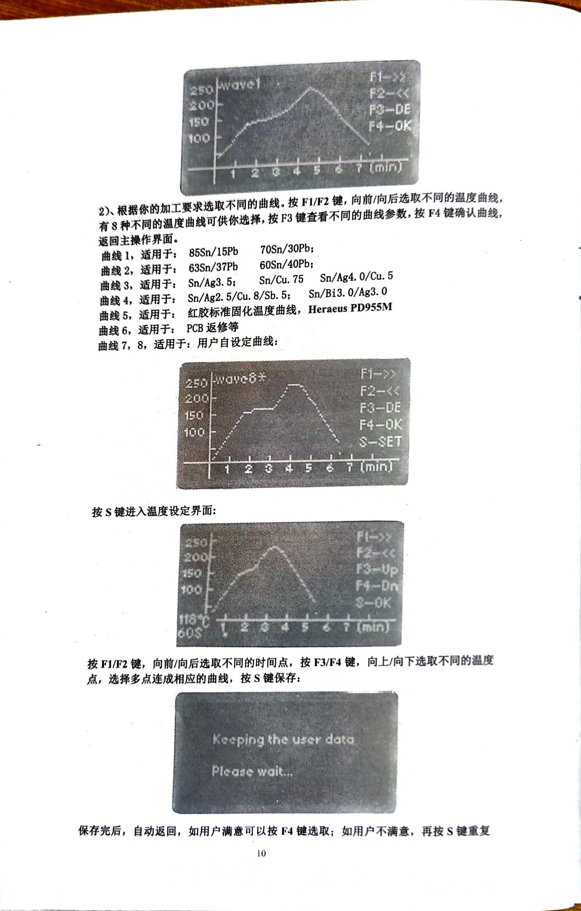
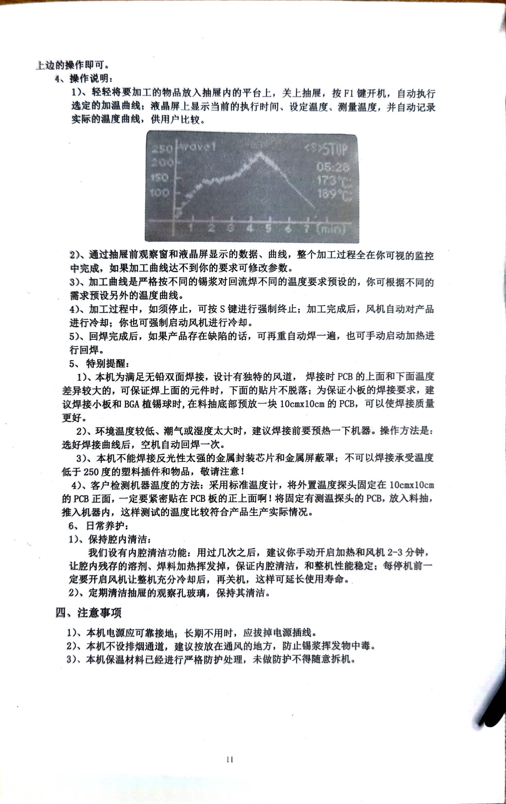

# :open_book:T-962回流焊台说明书

## 省流版 

::: danger
**第一次使用前请阅读[**完整说明书**](#完整说明书)！**
:::

1. 开机后按`S`显示主界面
2. `F3`选择温度曲线，`F3`键可显示该曲线关键参数
3. `F1`执行温度曲线
4. 完成后蜂鸣器

| 曲线   | 适配锡膏配方                              |
|--------|------------------------------------------|
| 曲线1  | 85Sn/15Pb;  70Sn/30PD                     |
| 曲线2  | 63Sn/37Pb;  60Sn/40Pb                     |
| 曲线3  | Sn/Ag3.5;  Sn/Cu.75;  Sn/Ag4.0/Cu.5        |
| 曲线4  | Sn/Ag2.5/Cu.8/Sb.5;  Sn/Bi3.0/Ag3.0       |
| 曲线5  | 红胶标准固化温度曲线, Heraeus PD955M     |
| 曲线6  | PCB 返修等                               |
| 曲线7 8| 用户自定义曲线                           |

## 完整说明书

  
  
  
  
  
